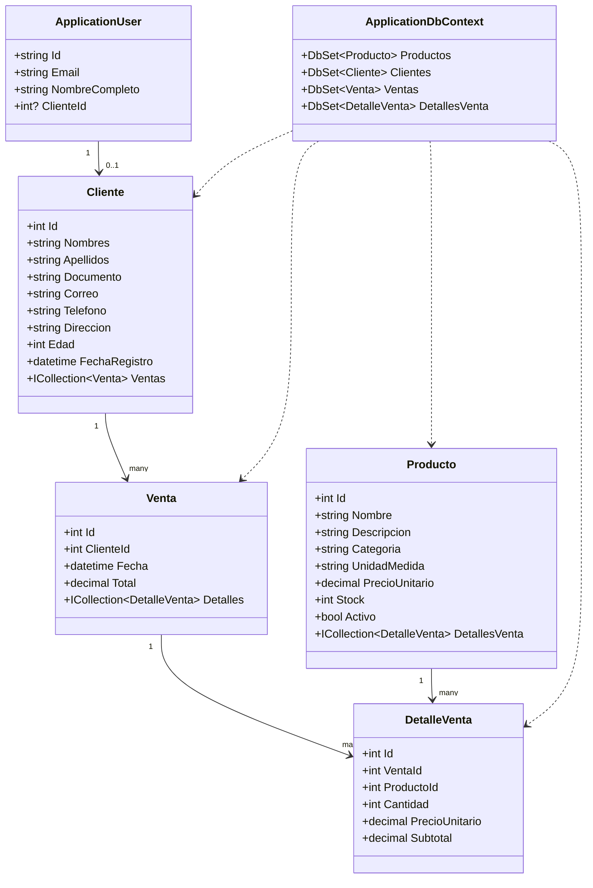

# Diagrama de clases (capa de dominio) — Firmeza

```mermaid
classDiagram
    class ApplicationUser {
        +string Id
        +string Email
        +string NombreCompleto
        +int? ClienteId
    }

    class Cliente {
        +int Id
        +string Nombres
        +string Apellidos
        +string Documento
        +string Correo
        +string Telefono
        +string Direccion
        +int Edad
        +datetime FechaRegistro
        +ICollection~Venta~ Ventas
    }

    class Producto {
        +int Id
        +string Nombre
        +string Descripcion
        +string Categoria
        +string UnidadMedida
        +decimal PrecioUnitario
        +int Stock
        +bool Activo
        +ICollection~DetalleVenta~ DetallesVenta
    }

    class Venta {
        +int Id
        +int ClienteId
        +datetime Fecha
        +decimal Total
        +ICollection~DetalleVenta~ Detalles
    }

    class DetalleVenta {
        +int Id
        +int VentaId
        +int ProductoId
        +int Cantidad
        +decimal PrecioUnitario
        +decimal Subtotal
    }

    class ApplicationDbContext {
        +DbSet~Producto~ Productos
        +DbSet~Cliente~ Clientes
        +DbSet~Venta~ Ventas
        +DbSet~DetalleVenta~ DetallesVenta
    }

    Cliente "1" --> "many" Venta
    Venta "1" --> "many" DetalleVenta
    Producto "1" --> "many" DetalleVenta
    ApplicationUser "1" --> "0..1" Cliente
    ApplicationDbContext ..> Cliente
    ApplicationDbContext ..> Producto
    ApplicationDbContext ..> Venta
    ApplicationDbContext ..> DetalleVenta
```
