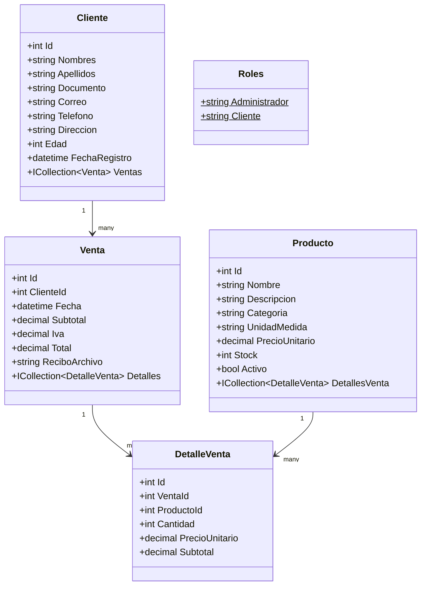
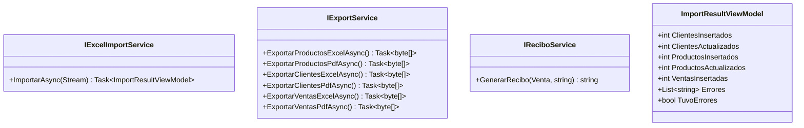
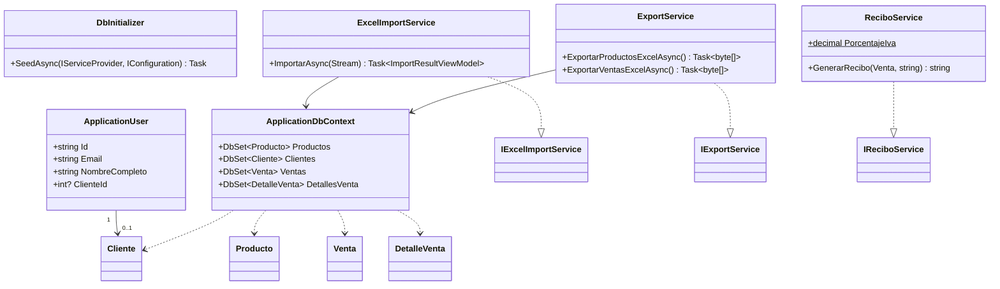
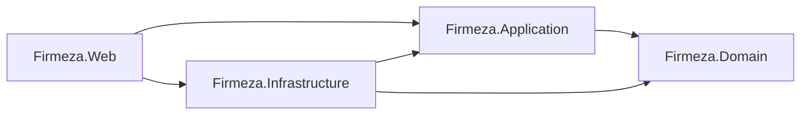

# Diagrama de clases — Firmeza (Clean Architecture)

## Capa Domain (Firmeza.Domain)

## Capa Application (Firmeza.Application)

## Capa Infrastructure (Firmeza.Infrastructure)

## Direccion de dependencias

Firmeza.Domain no depende de ningun otro proyecto. Firmeza.Application
solo depende de Domain. Firmeza.Infrastructure implementa las interfaces
de Application y depende de EF Core, Npgsql, Identity, EPPlus y QuestPDF.
Firmeza.Web es el punto de composicion: registra las implementaciones
concretas y expone los controladores y vistas.
