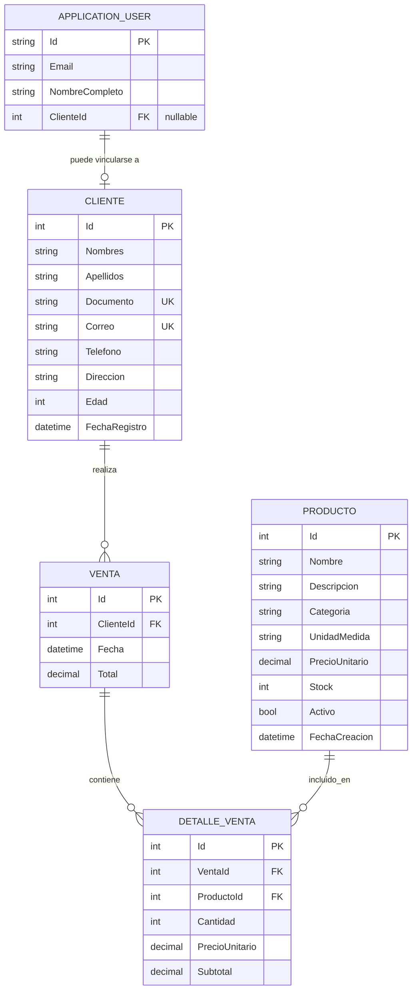

# Modelo Entidad-Relación — Firmeza

```mermaid
erDiagram
    CLIENTE ||--o{ VENTA : realiza
    VENTA ||--o{ DETALLE_VENTA : contiene
    PRODUCTO ||--o{ DETALLE_VENTA : incluido_en
    APPLICATION_USER ||--o| CLIENTE : "puede vincularse a"

    CLIENTE {
        int Id PK
        string Nombres
        string Apellidos
        string Documento UK
        string Correo UK
        string Telefono
        string Direccion
        int Edad
        datetime FechaRegistro
    }

    PRODUCTO {
        int Id PK
        string Nombre
        string Descripcion
        string Categoria
        string UnidadMedida
        decimal PrecioUnitario
        int Stock
        bool Activo
        datetime FechaCreacion
    }

    VENTA {
        int Id PK
        int ClienteId FK
        datetime Fecha
        decimal Total
    }

    DETALLE_VENTA {
        int Id PK
        int VentaId FK
        int ProductoId FK
        int Cantidad
        decimal PrecioUnitario
        decimal Subtotal
    }

    APPLICATION_USER {
        string Id PK
        string Email
        string NombreCompleto
        int ClienteId FK "nullable"
    }
```

**Roles de Identity:** `Administrador` (acceso al panel Razor) y `Cliente`
(sin acceso a Razor; pensado para consumir la app vía Blazor/React/Angular/Vue).
